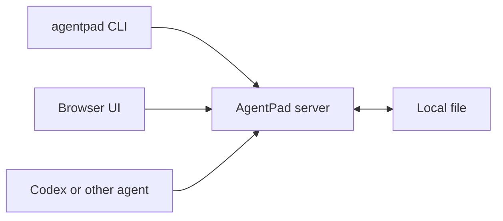

# AgentPad

AgentPad is a local-first review workspace for humans and coding agents. Open a real file, discuss it in threaded comments anchored to exact text, and let agents update the document through the same collaboration layer.

https://github.com/user-attachments/assets/9ec7d0c0-871a-4589-8e4e-9aa9cddd0093

## How It Works

- The `agentpad` CLI opens a real local file and talks to the AgentPad server.
- The server keeps comments, anchors, and edits in sync while preserving the file as a normal file on disk.
- The browser UI is where humans and agents review the document together.
- Edits still land back in the local file, so you can keep using your normal tools and workflows.



## Quickstart

### 1. Install

```bash
go install github.com/cyrusaf/agentpad@latest
agentpad install-skill
```

### 2. Start AgentPad

```bash
agentpad serve
```

Then open `http://127.0.0.1:8080` in your browser.

### 3. Open a file

```bash
agentpad open /path/to/file.md
```

That opens the local file in the AgentPad UI so you can read it, comment on it, and share the same document with an agent.

### 4. Ask Codex to work in AgentPad

```text
Use $agentpad to review /path/to/file.md in AgentPad.
Start the AgentPad server if needed.
Reply in existing AgentPad threads instead of editing sidecar metadata directly.
When you need to update the document, use agentpad read --json to get an anchor and then use agentpad edit with that anchor.
For multiline inserts or replies, prefer agentpad edit --text-file / agentpad threads reply --body-file so real newlines are preserved.
```

## Advanced CLI Flow

The CLI is mainly useful for agents and automation once the basic workflow above is working.

```bash
agentpad open ./plan.md --json
agentpad read ./plan.md --quote "rollback signal" --prefix "define the " --json
agentpad edit ./plan.md --anchor-file /tmp/anchor.json --text "rollback threshold" --json
agentpad threads create ./plan.md --start 120 --end 168 --body "Split this into two PRs." --json
```

For agent-driven edits, the preferred flow is:

1. `agentpad read ... --json` to get a reusable `anchor`
2. `agentpad edit ... --anchor-json/--anchor-file --text ...` to apply the edit through AgentPad's collab engine
3. For multiline text, use `--text-file` or `--body-file` instead of shell-escaped `\n`

Low-level `edit --start/--end --base-revision ...` still exists, but anchor-first editing is the safer default for concurrent human + agent work.

## Install The Skill Manually

`agentpad install-skill` is the fastest path. If you want to install from a local checkout manually instead, link [skills/agentpad/SKILL.md](skills/agentpad/SKILL.md) into `${CODEX_HOME:-$HOME/.codex}/skills/agentpad`.

## Config

AgentPad reads `agentpad.toml` from the current working directory, then falls back to `~/.agentpad/config.toml` when no local config is present. Override with `--config` or `AGENTPAD_CONFIG`.

Key sections:

- `[server]`: listen address and base URL
- `[storage]`: root directory for AgentPad runtime metadata
- `[identity]`: default display name for the CLI

## Local Development

Start the server:

```bash
go run . serve
```

Run the web app in another terminal:

```bash
cd web
npm install
npm run dev
```

## Tests

Backend:

```bash
go test ./...
```

Frontend:

```bash
cd web
npm test
npm run build
```
